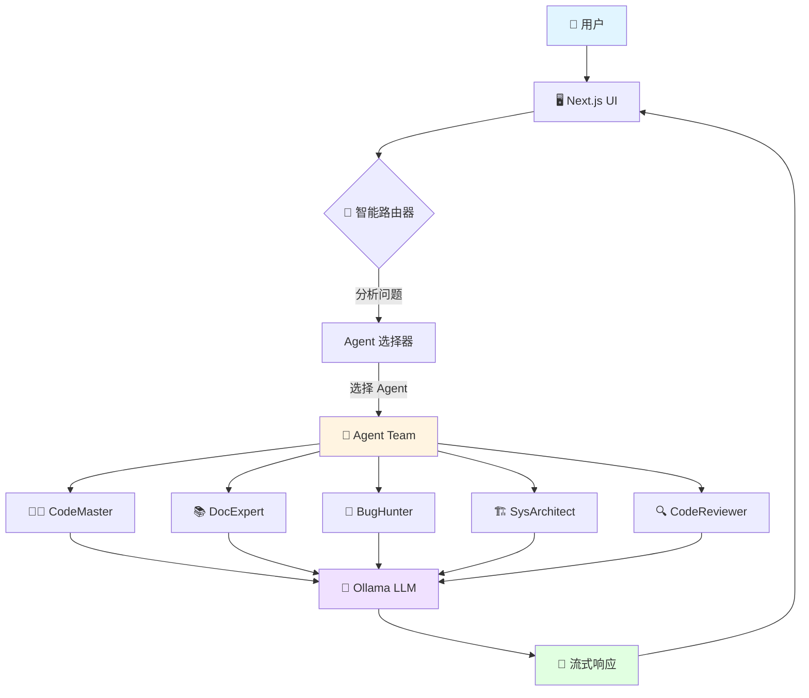
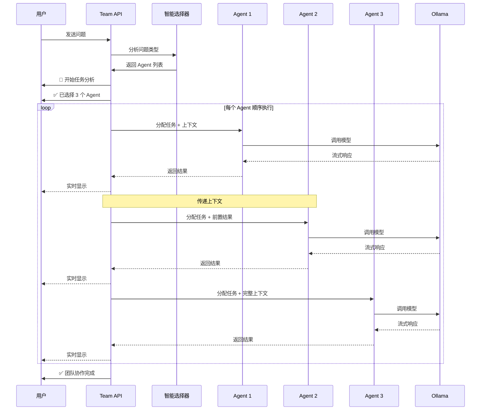

# 🤝 Multi-Agent Team 系统架构

## 📊 系统架构图



## 🔄 协作流程



## 🏗️ 文件结构

```
AI-studio/
├── app/
│   ├── api/
│   │   ├── chat/
│   │   │   └── route.ts          # 单 Agent API
│   │   └── team/
│   │       └── route.ts          # 🆕 Multi-Agent Team API
│   └── page.tsx                  # 🆕 增强 UI（Team 模式切换）
│
├── lib/
│   ├── agents/                   # 🆕 Agent 系统
│   │   ├── types.ts             # Agent 类型定义
│   │   ├── configs.ts           # Agent 配置 + 智能选择器
│   │   ├── team.ts              # Team 协调器（核心逻辑）
│   │   └── README.md            # Agent 系统文档
│   └── tools/                    # 工具系统
│       ├── index.ts
│       └── weather.ts
│
├── TEAM_GUIDE.md                # 🆕 使用指南
└── README.md                     # 项目文档
```

## 🧩 核心组件说明

### 1️⃣ 智能选择器 (`selectAgentsForTask`)

**功能**: 根据问题关键词自动选择合适的 Agent

```typescript
// 示例输入输出
selectAgentsForTask("实现一个排序算法")
// → ['coder']

selectAgentsForTask("设计一个高并发系统架构，并实现核心代码")
// → ['architect', 'coder']

selectAgentsForTask("我的代码有bug，帮我找出来并优化")
// → ['debugger', 'reviewer']
```

**匹配规则**:
- 扫描问题中的关键词
- 与预定义的关键词库匹配
- 返回匹配到的所有 Agent
- 默认至少返回 `coder`

### 2️⃣ Agent Team 协调器 (`AgentTeam` class)

**核心方法**:

```typescript
class AgentTeam {
  // 初始化（配置 LLM）
  constructor(ollamaBaseUrl: string, model: string)
  
  // 核心协作流程（异步生成器）
  async *processWithTeam(question: string): AsyncGenerator<string>
  
  // 构建 Agent 提示词
  private buildAgentPrompt(agent, question, previousContext, isLastAgent): string
  
  // 获取协作上下文
  getContext(): TeamContext
}
```

**工作流程**:
1. 分析问题 → 选择 Agent
2. 按顺序执行每个 Agent
3. 后续 Agent 能看到前面的结果
4. 流式返回所有输出

### 3️⃣ Agent 配置 (`AGENT_CONFIGS`)

每个 Agent 包含：
- `name`: Agent 名称
- `role`: 角色描述
- `emoji`: 视觉标识
- `description`: 功能描述
- `specialties`: 专长列表
- `temperature`: 模型温度（创造性程度）
- `systemPrompt`: 系统提示词（定义行为）

**温度说明**:
- `0.3` - 低温（代码、审查）→ 准确性优先
- `0.5` - 中温（文档）→ 平衡
- `0.6` - 较高温（架构）→ 创造性优先

## 🔀 单 Agent vs Team 模式对比

### 单 Agent 模式流程

```
用户问题 → API → 单个 Agent → LLM → 响应
```

**特点**:
- ⚡ 快速响应
- 🎯 单一视角
- 💚 资源消耗低

### Team 模式流程

```
用户问题 
  → 智能选择器（选择 Agent）
  → Agent 1 → LLM → 结果 1
  → Agent 2 → LLM（+ 结果 1）→ 结果 2
  → Agent 3 → LLM（+ 结果 1+2）→ 结果 3
  → 综合输出
```

**特点**:
- 🌈 多角度分析
- 📚 更全面的解答
- 🔗 上下文传递
- ⏱️ 耗时较长

## 💡 关键设计决策

### ❓ 为什么选择顺序执行而非并行？

**原因**:
1. **上下文共享**: 后续 Agent 需要看到前面的结果
2. **协作效果**: 形成完整的解决方案链条
3. **资源控制**: 避免同时占用过多 Ollama 资源

### ❓ 为什么使用流式输出？

**原因**:
1. **用户体验**: 实时看到进展，不需要等待
2. **长响应支持**: Agent 可能生成大量内容
3. **透明度**: 用户能清楚看到每个 Agent 的工作

### ❓ 如何避免重复和冗余？

**策略**:
1. **明确职责**: 每个 Agent 有专门的系统提示词
2. **上下文传递**: 告诉 Agent 前面的工作成果
3. **角色强调**: 在提示词中强调"从 XX 角度"

## 🎨 UI 交互设计

### 状态管理

```typescript
// 核心状态
const [isTeamMode, setIsTeamMode] = useState(false)

// API 选择
const apiEndpoint = isTeamMode ? '/api/team' : '/api/chat'

// 请求格式
const requestBody = isTeamMode
  ? { question: userMessage, model: selectedModel }  // Team: 直接问题
  : { messages: newMessages, model: selectedModel }   // 单: 完整对话历史
```

### 响应渲染

**增强的 Markdown 解析**:
- 识别 `---` 分隔线
- 识别 `**粗体**` 文本
- 识别 emoji 开头的行
- 自动换行和格式化

## 🚀 扩展建议

### 1. 添加更多 Agent

```typescript
// 测试专家
tester: {
  name: 'TestMaster',
  role: '测试专家',
  emoji: '🧪',
  specialties: ['单元测试', '集成测试', 'E2E 测试'],
  // ...
}

// DevOps 专家
devops: {
  name: 'OpsExpert',
  role: 'DevOps 专家',
  emoji: '🔧',
  specialties: ['CI/CD', 'Docker', 'Kubernetes'],
  // ...
}
```

### 2. 实现 Agent 记忆

```typescript
interface AgentMemory {
  previousInteractions: Interaction[]
  learnedPatterns: Pattern[]
  userPreferences: Preferences
}
```

### 3. Agent 评分和选择优化

```typescript
interface AgentScore {
  agentId: string
  relevanceScore: number  // 相关度评分
  confidenceScore: number // 置信度评分
}

// 根据评分排序和选择
const rankedAgents = scoreAndRankAgents(question)
```

### 4. 并行 + 汇总模式

```typescript
// 多个 Agent 并行工作
const results = await Promise.all([
  agent1.process(question),
  agent2.process(question),
  agent3.process(question),
])

// 最后一个 Agent 汇总
const summary = await summarizerAgent.process(results)
```

## 📈 性能优化建议

1. **缓存常见问题**: 使用 Redis 缓存高频问题的答案
2. **流式优化**: 使用 Server-Sent Events (SSE) 替代 ReadableStream
3. **并行化**: 对于独立的 Agent，可以并行执行
4. **模型选择**: 为不同 Agent 配置不同大小的模型
5. **批处理**: 合并多个小请求到一个大请求

## 🔐 安全性考虑

1. **输入验证**: 检查问题长度和内容
2. **速率限制**: 防止恶意频繁请求
3. **资源控制**: 限制单次会话的 Agent 数量
4. **敏感信息**: 过滤 API Key、密码等敏感内容
5. **超时控制**: 设置 Agent 执行超时时间

---

## 📚 相关资源

- [LangChain 官方文档](https://js.langchain.com/docs/)
- [Ollama 官方文档](https://ollama.ai/docs)
- [Multi-Agent Systems 论文](https://arxiv.org/abs/2308.08155)
- [使用指南](./TEAM_GUIDE.md)
